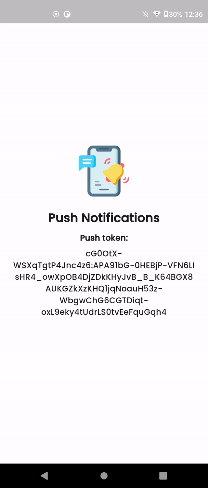
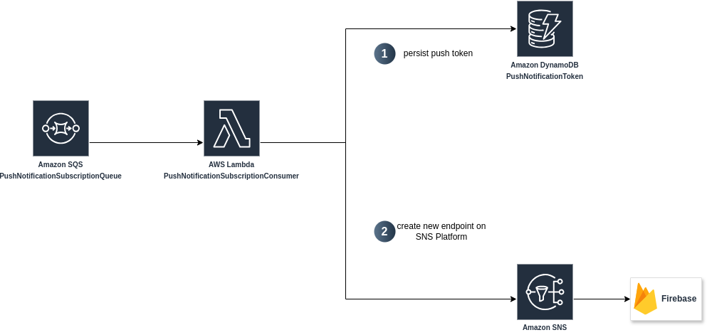
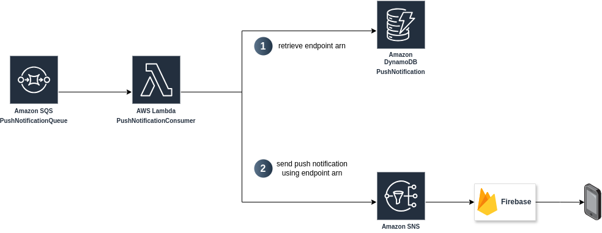

# How to send push notification to your Flutter app with Firebase and AWS

In this demo we're going to build a serverless solution on AWS to send push notifications to your Flutter app using Firebase.



design credits: https://dribbble.com/shots/25519212-App-UI

## Setup and deploy the infrastructure and run the app

Prerequisites:

 - Google Cloud and Firebase account
 - AWS account
 - VSCode with "Remote Development" extension
 - Docker

### 1. Setup Firebase project

1. Create a new project in Firebase using your Google account

2. Open the project in dev container and
  
    1. login into your firebase account
    
        ```sh
        firebase login --no-localhost
        ```

    2. init firebase project

        ```sh
        firebase init
        ```

        and follow the wizard, particularly:

        - select at least one service from those seggested, for example *Functions* we'll delete it later since we don't need it.
        - choose *Crate new project* option and give it the name *test-flutter-aws-push-not*

        after Firebase has been created, delete the following resources:
        - firebase.json (will be created again in the next step)
        - functions folder

    3. configure flutterfire

        ```sh
        flutterfire configure --project=test-flutter-aws-push-not --platforms=android --android-package-name=com.example.push_notification.dev
        ```
        
    4. in firebase under Project settings > Your apps provide SHA certificate by clicking on *Add fingerprint* and as value provide:
        - for testing purpose only (our case)

            ```sh 
            cd android
            ./gradlew signingReport -Pflavor=dev
            ``` 

            use SHA1 value printed in the console

            if you receive an error like this one:

            ```
            > Task :url_launcher_android:signingReport
            Variant: debugAndroidTest
            Config: debug
            Store: /root/.android/debug.keystore
            Alias: AndroidDebugKey
            Error: Missing keystore
            ```

            then run:

            ```sh
            keytool -genkey -v -keystore ~/.android/debug.keystore -keyalg RSA -keysize 2048 -validity 10000 -alias androiddebugkey -storepass android -keypass android
            ```

    5. download google-services.json and replace it in android/app/google-services.json

    6. configure flutter fire for GCM

    ```sh
    firebase login
    flutterfire configure
    ```

### 2. Deploy the infrastructure on AWS

1. open the project in dev container

2. configure aws cli by running ```aws configure```

3. create manually the push notification platform on aws (unfortunately, at the moment, it cannot be created via iac)
    - open Firebase > Project Settings > Service accounts and click on "Generate new private key", download and secretly store the json file
    - go to SNS and create a new platform application:
        - use FCM as push notification platform
        - choose Token as Authentication method and upload the json file previously downloded
        - create the plaform

4. open ```aws/samconfig.yaml``` and modify *PushNotificationPlatformArn* parameter value with the arn of the platform just created.

5. deploy aws

    ```sh
    cd aws
    sam build && sam deploy --config-env "test"
    ```

### 3. Run the app

#### Run the app on an Android device

- connect your device via Debug WiFi
- run the configuration (in my case) *moto g 5g plus (debug)*

Now you're ready to go! You should be able to login in the app with your Google account.

##### How to run via adb debugging (wifi)

- make sure both the Android device and your computer are connected to the same WiFi
- on your Android device go under *"System" > "Developer options" > "Debug wireless"* and click on *"Pair device with pairing code"*
- run the project inside the container and run

```sh
adb pair [ip]:[port]
```

*ip* and *port* are given by the device when clicking on *"Pair device with pairing code"*

- enter the pairing code
- on your android device close the pairing screen and look at the *"IP address and port"*

```sh
adb connect [ip]:[port]
adb devices
flutter run -d 192.168.0.102:40945
```

to run in debug mode add the following config inside .vscode/launch.json

```json
{
  "version": "0.2.0",
  "configurations": [
    {
      "name": "Flutter on Device",
      "type": "dart",
      "request": "launch",
      "flutterMode": "debug",
      "deviceId": "192.168.0.102:40945"
    }
  ]
}
```

### 4. Send push notification in action

1. send the following message to *PushNotificationSubscriptionQueue* queue

```json
{
  "event": "UPSERT_PUSH_TOKEN",
  "payload": {
    "pushToken": "xyz", // token from Firebase
    "os": "android",
    "receiverId": "1234" // unique identifier (email or cognito sub for example)
  }
}
```

this message triggers the following flow which allows Firebase to register the device (pushToken) ready to receive push notifications



2. send the message json to *PushNotificationQueue* queue

```json
{
  "Type": "Notification",
  "Message": "{\"event\":\"CUSTOMER_BOOK_APPOINTMENT\",\"data\":{\"customerName\":\"Davide\",\"appointmentId\":117,\"receiverId\":\"1234\",\"appointmentDate\":\"2024-11-19T17:00:00+00:00\"}}"
}
```

this message triggers the following flow which Firebase  to send push notification to the device associated with receiverId

